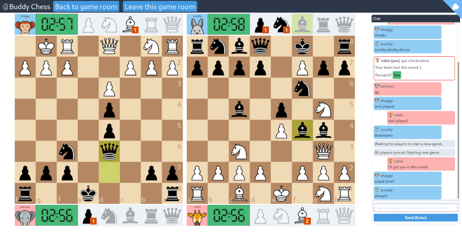

I made a thing over the last few weeks; https://utopia.buddychess.com/[Buddy Chess  (utopia)^]: A friendly place for your https://en.wikipedia.org/wiki/Bughouse_chess[bughouse chess^] needs.
Here I will try to compile my notes and retrospective thoughts for future reference.

[discrete]
=== TLDR

== A friendly bughouse chess server: Buddy Chess (utopia)

.Buddy Chess (utopia) in action
[#image:buddy-chess-utopia-screenshot]

=== What is bughouse chess?

____
Bughouse is the _funnest_ of chess variations (citation not needed).

Breaking the solitary mold of chess, bughouse is a chess variation that lets you team up with a buddy for a fast paced chess game where you use your superior strategy and communication to slip through the cracks of opponents defenses.

-- https://utopia.buddychess.com/[Buddy Chess  (utopia)^]
____

Bughouse is usually played in teams of two. In the seating layout (<<image:bughouse-seating-layout>>), your team mate sits to your side and holds the same color pieces as your opponent.

.Bughouse seating layout
[#image:bughouse-seating-layout]
image::bughouse-seating-layout.png[]

Two main twists are introduced to the usual chess rules.

1. All pieces that you capture on your board will be passed to your team mate. You can think of it as these pieces go to your team mate's spare piece stash.
2. On your turn you can drop a piece from your spare stash on to your board (Pawns cannot be dropped on the first or last rank).

That's pretty much it. Read more thoroughly about https://en.wikipedia.org/wiki/Bughouse_chess[bughouse on wikipedia^].

== Backstory

http://lichess.org[Lichess^] is my favourite online chess site due to its https://lichess.org/blog/U4skkUQAAEAAhIGz/why-is-lichess-free[ideals^].
But sadly lichess team is reluctant to add my favorite chess variation (for good reasons).

____
Clocks, time controls and ending conditions are the hardest things on the impl side. 
It's all doable but not a priority because it would make lichess more difficult to maintain and variants are less than 1% of site traffic in general.

We're trying to avoid adding potentially unpopular variants that add complexity to the site, and the bughouse exceptions for mates and clock start are significant.

-- isaacly (lichess contributor) https://lichess.org/forum/team-fics-bughouse/lichess-bughouse-petition#3
____

Chess.com which has done a great deal for the online chess boom has released support for https://www.chess.com/bughouse[online bughouse^].
But the UX for a simple game with just 4 friends needs more love.

There was an https://www.youtube.com/watch?v=Q2oxnkwvO_E&t=1s[experimental fork^] of lichess for bughouse at www.bughousetest.com.
The site was dead the last time I checked.
During the days it was live there was a small but dedicated community running weekly tournaments.
If I were to speculate why the site is dead now, I would say the maintence burden of the site was not worth it for the amount of site activity.

With all that said I wanted to add in my own spin to the mix focusing on friendly matches.

== Goals

Playable multiplayer bughouse::
* Obviously implement the game logic
* But also have proper UI with
** Full dual board display fitting into the screen
** Clock, spare stash and profile view
** Text and voice chat

Reduce maintanence burden::
* Try to keep server costs at $0
** so there's no reason to shutdown the site for inactivity
* Be careful about features considered to be in scope
** Keep matchmaking out of scope
** Keep anti cheat mechanisms out of scope
** Keep profiles and leader boards out of scope (these usually attracts cheaters)

Target the casual bughouse chess community::
* As a place to play couple of bughouse matches among a group of friends

Learn a thing or two along the way::
* It is a side project after all

== Mission plan

. Build an invitational game room system
. Use P2P message passing for communication and reduce reliance on a central server
. Extend chess library with bughouse rules
. Put together bughouse chess board user interface
. Stitch everything together into a cohesive system

== Built on shoulders of giants

Chessboard - https://github.com/ornicar/chessground[chessground^]::
Chessground by the lichess team is a battle tested project used in production at lichess.
The API code is fully typed and commented which more than made up for lack of a manual.
I had a hard time understanding themes and css styles.
But there is enough examples provided to experiment and prototype.

Original chess rules - https://github.com/jhlywa/chess.js[chess.js^]::
WebRTC: for P2P - https://github.com/feross/simple-peer[simple-peer^]::
Firebase: for peer discovery and signaling - https://firebase.google.com[firebase^]::
Assymetric encryption for public channels - https://github.com/dchest/tweetnacl-js[tweetnacl-js^]::
Frontend - https://svelte.dev/[svelte^] and https://tailwindcss.com/[tailwind-css^]::
I have used this combination for couple of projects now, so I have gotten comfortable with them.
At the moment I prefer the svelte's approach to reactive front end as it keeps development simple.
I do like the premise of tailwind css as a utility toolkit.

Github actions: for continous deployment - https://github.com/features/actions[github actions^]::
Github actions is free for light usage and easy enough to setup, so it would not be wise to ignore it as a tool.

== Interesting ideas in the backend