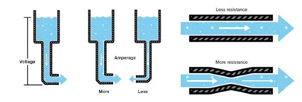
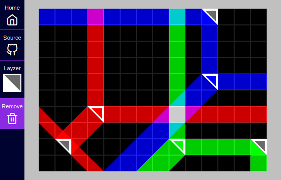
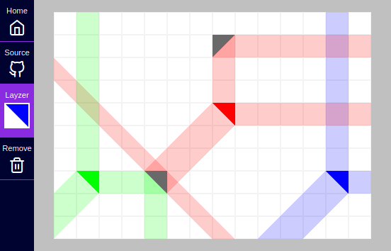

I made a thing over the weekend; https://lab.sransara.com/lay-zers[lay-zers^]: a "laser" playground for the imaginative.
Here I will try to compile my notes and retrospective thoughts for future reference.

[discrete]
=== TLDR

* Pick a project that's been lingering in the mind for far too long
 ** Produce the best effort output with in self allocated time -> get feedback -> iterate
 ** Any rabbit hole ideas can be noted down and followed up later
* Have a plan on how to handle asymmetry of input events across different device types
* Write to gain clarity of thoughts
* https://github.com/pixijs/pixi.js[Pixi.js^] and https://www.typescriptlang.org[Typescript^] are cool

== Backstory

This last long weekend I sat down for a programming project with a personal challenge: 
start a project and see its way through to something usable by the end of weekend.
This is a trick to alleviate my tendency to chase down rabbit holes in personal projects.

[quote, Douglas Adams]
I love deadlines. I like the whooshing sound they make as they fly by.

I needed a stepping stone project idea to get the hang of some basics for a future project idea brewing in my mind.
Coming in near future to a browser near you: A pixel playground to experiment with the water as electricity analogy (<<image:water-as-electricity>>).

.Water as electricity analogy https://learn.sparkfun.com/tutorials/voltage-current-resistance-and-ohms-law[from Sparkfun: Voltage, Current, Resistance, and Ohm's Law^]
[#image:water-as-electricity]

Sounds cool? Yes! (to me at least).
Well, back in the real wold I needed to set some goals for the weekend's stepping stone project.

* Have a finished deliverable by end of the weekend.
* Learn about 2D HTML5 canvas graphics and WebGL.
* Freshen up my vector knowledge.
* Get an idea how to design apps to be usable in variety of screen sizes and input controls.
* Try out Typescript (in an intense battle of https://www.typescriptlang.org/[Typescript^] vs https://clojurescript.org/[Clojurescript^], Typescript won by context).
* And also to write this note.

With these goals in check, lay-zers was born.

== A laser playground for the imaginative: lay-zers

In https://lab.sransara.com/lay-zers/[lay-zers^], you get a canvas to plop down _layzers_ and see how they interact with each other in an https://en.wikipedia.org/wiki/Additive_color[additive color model^] just like real lasers.

.lay-zers playground in action
[#image:layzers-screenshot]

== Lessons learned along the way

By the end of the weekend I was able to get the _thing_ out in to the world.
At the end _it_ was not about getting a _thing_ out in the world.
But _it_ was about the lessons learned along the way.

=== On planning and productivity

I saw a significant productivity boost as I was *working towards an idea or a set of goals with a strict deadline*.
This self-imposed constraint made a significant dent in my time spent on the usual _rabbit holes_:

* Researching prior art
* Is this best way to do it?
* Thinking about the best abstractions
* Imagining new features
* Any interesting problems in this space?
* and many more ...

We can spend _zero_ time on this, or we can even spend _infinite_ time on this.
Either option is not ideal.
Finding a middle ground depends on the context and can be a struggle.
It is a struggle because, of the push and pull between our need to release a quality output and the time constraint.

So the second takeaway for me here is to *release thy self from the need to produce the most perfect output*.

* Produce the best effort output with in self allocated time → get feedback → iterate
* Any rabbit hole ideas can be noted down and followed up later

I may have re-discovered a simple form of agile development method for personal projects.
Not sure how this mindset will pan out for a more serious project.
But I'm excited to apply this for my future projects.

=== On 2D canvas

As my focus is on 2D graphics, I picked the *https://github.com/pixijs/pixi.js[Pixi.js^] library to help me deal with the HTML5 Canvas and WebGL*.
I don't think I have any authority to make any absolute claims on this topic.
But I have a good impression of Pixi because it had good enough of everything that I needed for this project.
I think I will continue to use it for later projects.

* Easily navigable https://pixijs.download/release/docs/index.html[documentation^]
* Thorough https://pixijs.io/examples/[examples^]
* Typescript support
* Active help in the https://www.html5gamedevs.com/[HTML5 Game Devs forum^]
* Easily usable by a noob like me
* And some cool optimizations like https://medium.com/swlh/inside-pixijs-batch-rendering-system-fad1b466c420[batch renderer^] and https://medium.com/swlh/inside-pixijss-high-performance-update-loop-856fb1d841a0[more^]

=== On cross device compatible app design

This was a hard nut to crack.
Props to those who work on GUI design day to day.

Here the takeaway for me was to *be mindful of the asymmetry of input events in different types of devices*.
Mouse inputs have hover, right-click and also mouse with keyboard combos.
Touch devices can support myriad different multi-touch gestures.
The https://developer.mozilla.org/en-US/docs/Web/API/Touch_events[Web touch API^] seems plenty versatile to support any gesture we can dream of.
Out of place interaction modes play a decisive role in the usability of an app.

This is an example where the deadline based time constraint stopped me from following another feature rabbit hole.
So for this project I short circuited all this complexity by only supporting left-click and single pointer on-touch events.

=== On Typescript

*https://www.typescriptlang.org/[Typescript^] provided a significant quality of life improvement over plain old Javascript*.
It was especially helpful to get the plumbing to be done right in the first pass.

* Good editor tooling support for Typescript
* Built-in Typescript support in Pixi
* Minimal config web app bundling with https://parceljs.org/[Parcel.js^]

I wonder how this would have played out if I had picked Clojurescript.
Probably the difference in programming paradigms will lead to different sets of pros and cons.
But I believe for this type of project Typescript was a better choice due to library support and imperative coding style.

=== On writing about it

Although writing this note was a goal from the beginning, I had a tough time to convince my self that this measly project warrants a write-up.
At the end I ended up writing this note to hold my self accountable, but I am glad I did it.
It let me put down the thoughts, doubts and feelings that I had from this weekend challenge while the memories are fresh.

*Writing helps to bring clarity to my fleeting thoughts and ideas*.

Only while doing this write-up I realized a glaring bug in lay-zers.
See if you can notice something fishy in <<image:old-layzers-screenshot>>.

.lay-zers with a glaring bug
[#image:old-layzers-screenshot]

For a playground of lasers, the colors blends looks like paint mixing, not like light mixing.
This is because of different modes of color mixing:

* https://en.wikipedia.org/wiki/Additive_color[Additive color mixing^] is how natural lights blend
* https://en.wikipedia.org/wiki/Subtractive_color[Subtractive color mixing^] is how colors blend in inks

Now that this bug is gone, you can have around 90% experience of a real laser playground in https://lab.sransara.com/lay-zers/[lay-zers].

== Retrospective thoughts on lay-zers

____
The https://lab.sransara.com/lay-zers/[playground^] itself is very nonrestrictive and sans objectives.
_(1)_ It's goal is to *inspire you to imagine your own game* out of _layzers_.
Once you are struck with an amazing game idea with layzers, then _(2)_ this codebase should provide the code blocks necessary for *bringing life to your next hit game*.
The https://github.com/sransara/lay-zers/blob/master/src/main.ts[main codebase^] is extendible but straight forward with just the right amount of abstractions, if I say so myself.
_(3)_ If nothing else, this project should serve as a an interesting https://www.pixijs.com/[Pixi.js^] demo.

-- https://github.com/sransara/lay-zers/blob/master/README.md[lay-zers README^]
____

A game is made interesting by the constraints introduced and objectives it poses.
Problem with lay-zers being a playground is that it lacks these two factors to make it interesting.
We can introduce a simple set of constraints and objectives like: using minimum needed emitting layzers make the color magenta.
And that itself makes the whole thing interesting.
I am just too lazy to work on taking layzers to the next level at the moment.
As the tag lines says: I've left the playground for the users's imagination to create their own puzzles.

== Conclusion

* Pick a project that's been lingering in the mind for far too long
 ** Produce the best effort output with in self allocated time → get feedback → iterate
 ** Any rabbit hole ideas can be noted down and followed up later
* Have a plan on how to handle asymmetry of input events across different device types
* Write to gain clarity of thoughts
* https://github.com/pixijs/pixi.js[Pixi.js^] and https://www.typescriptlang.org[Typescript^] are cool

All in all, I would say this weekend challenge was a success.
Let's see how these lessons pan out for my upcoming projects.
